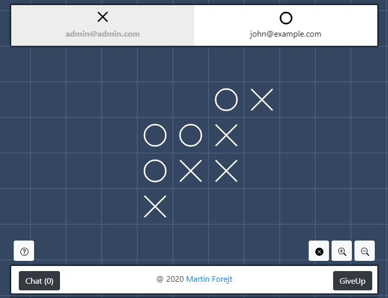
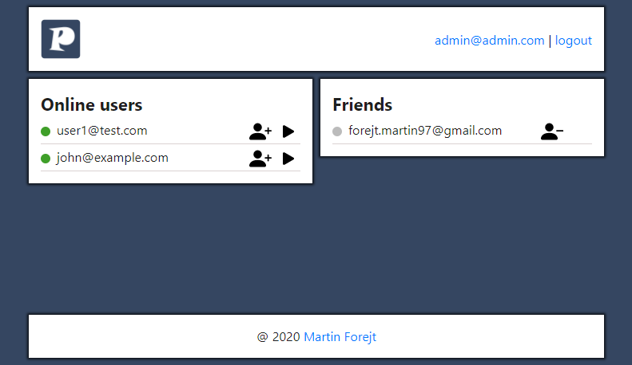
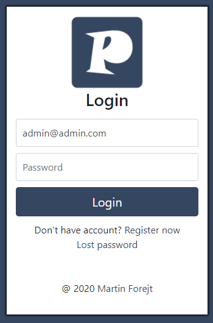
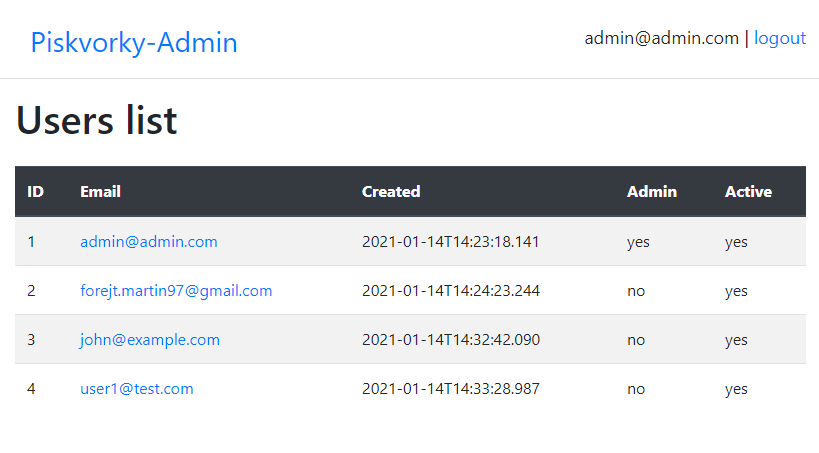

# Piskvorky
Piskvorky is TicTacToe multiplayer game build with Kotlin Multiplatform.
#Table of Contents
<!--ts-->
* [Technologies](#technologies)
* [Installation](#installation)
* [Project description](#project-description)
* [Screenshots](#screenshots)
* [Notes](#notes)
<!--te-->
Technologies
============

Installation
============

Project description
============

Screenshots
============
Game
-----

Lobby
-----

Login page
-----

Admin
-----

Notes
============
Repository used Alpha features such as Kotlin Multiplatform and some problems with that may occur.

There is list of known issues:
- Netty exception on every request: https://youtrack.jetbrains.com/issue/KTOR-646
- Ktor's websocket auto ping/pong seems not working

KIV/PIA
-----
This repository is semestral work of KIV/PIA.

Please see [this doc](doc/DOC.md).
