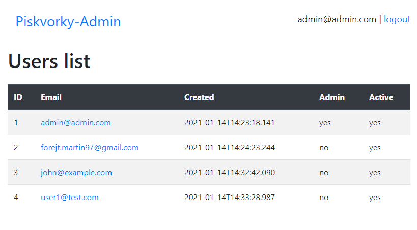
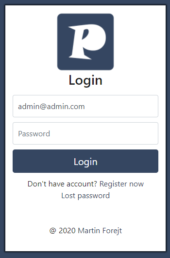
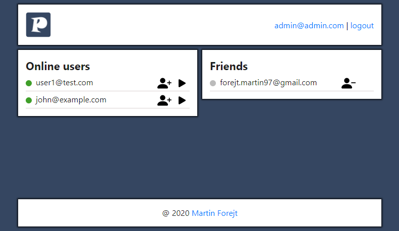
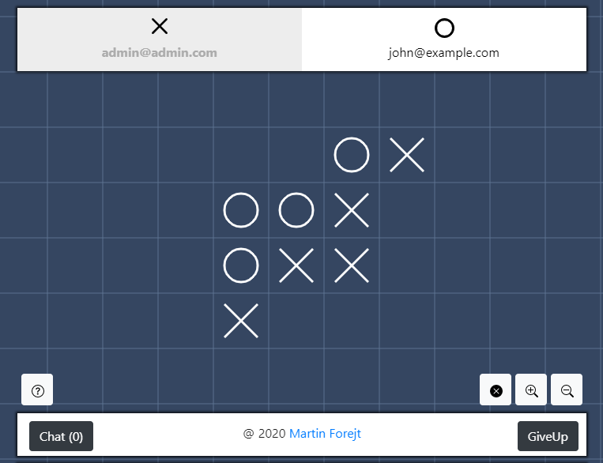

# Piskvorky - Semestrální práce KIV/PIA 2020/2021
Autor: Martin Forejt, A20N0079P, mforejt@students.zcu.cz

Note: this file is also available as [pdf](DOC.pdf).

Obsah
============
<!--ts-->
* [Zadání](#zadání)
* [Technologie](#technologie)
* [Instalace](#instalace)
* [Použití](#použití)
* [Architektura a Implementace](#architektura-a-implementace)
* [Testování](#testování)
* [Možná vylepšení](#možná-vylepšení)
* [Známé problémy](#známé-problémy)
* [Bonusové části](#bonusové-části)
<!--te-->

Zadání
============
viz https://github.com/osvetlik/pia2020/tree/master/semester-project

Technologie
============
Aplikace je z 95% napsaná v Kotlinu a jsou mimo jiné použity tyto technologie a knihovny:
- [Kotlin Multiplatform](https://kotlinlang.org/docs/reference/multiplatform.html)
  \- pro možnost sdílení kódu mezi serverem napsaným v kotlin/jvm a klientem v kotlin/js
- [Ktor](https://github.com/ktorio/ktor)
  \- framework pro tvorbu http serveru a internetových aplikací
- [Serialization](https://github.com/Kotlin/kotlinx.serialization)
  \- knihovna pro serializaci zpráv v json API
- [Koin](https://github.com/InsertKoinIO/koin)
  \- dependency injection framework pro kotlin (je použita alpha verze s podporou pro kotlin/multiplatform)
- [kotlin-react](https://github.com/JetBrains/kotlin-wrappers/tree/master/kotlin-react)
  \- knihovna pro kotlin/js obalující frontend framework ReactJS
- [Exposed](https://github.com/JetBrains/Exposed)
  \- ORM framework pro Kotlin
- [OpenApi](https://www.openapis.org/)
  \- pro generování api kódu ze [specifikace](../domain/api/specs/piskvorky-v1.0.yaml)
- [SASS](https://sass-lang.com/)
  \- pro psaní a generování css kódu
- Gradle - pro automatizaci sestavení 
- MySQL

Instalace
============
K dispozici jsou soubory [run.bat](../run.bat) a [run.sh](../run.sh), který přeloží projekt pomocí gradlu
a spustí v dockeru za pomoci těchto příkazů:
```
gradlew build 
docker-compose build
docker-compose up
```
Server potom bude poslouchat na ```http://localhost:9090```   
Klient bude dostupný na ```http://localhost:80```


Použití
============

Role
-----
Existují dva typy uživatelů:
- **User** - může pouze hrát, má přístup k API a do klientské aplikace

- **Admin** (je zároveň User) - má přístup do administrace, kde vidí:
  - seznam uživatelů s možností jejich editace
  - seznam výsledků her

Po spuštění aplikace je automaticky vytvořen administrátor:
```
email: admin@admin.com
pass: test123
```

Server
-----
Server poslouchá na portu ```9090```.  
Rest API viz [specifikace](../domain/api/specs/piskvorky-v1.0.yaml) je dostupné na ```/api/v1/```.  
Administrace je dostupná na ```/admin```



Klient
-----
Klient (ReactJS aplikace) je dostupný na portu ```80```.

### Přihlášení
Je dostupné na url ```/login```. Z této stránky vedou ještě dva odkazy:
- registrace - obdobný formulář pro registraci nového uživatele
- ztracené heslo - formulář pro zadání emailu, na který je zaslaný odkaz pro změnu hesla
  - je potřeba nastavit object ```email``` v souboru [application.conf](../server/src/main/resources/application.conf)



### Lobby
V loby jsou dva panely s online uživateli a přáteli. U každého uživatele mohou být dvě ikony:
- pro přidání/odebrání daného uživatele do/z přátel
- pro vyzvání daného uživatele ke hře

V pravo nahoře jsou ještě dva odkazy:
- vlastní email s proklikem do nastavní (změna hesla)
- odhlášení 



### Hra
- Hra obsahuje nekonečnou desku, kterou lze myší posouvat a ikonami (v pravo dole) přibližovat/oddalovat.  
- Nahoře jsou vidět hráči, hráč na tahu je černě na bílém pozadí.  
- Ikona otazníku zobrazí nápovědu
- Ikona křížku vycentruje hrací plochu na první položený symbol (z důvodu možného ztracení se v nekonečném poli)
- Tlačítko ```Chat``` (s počtem nepřečtených zpráv) zobrazí chat
- Tlačítko ```GiveUp``` ukončí předčasně hru

#### Pravidla
- Hráč na tahu (kromě prvního tahu) musí umístit symbol na kterékoliv volné pole vedle jiného symbolu (v jakémkoli směru).
To je z důvodu nekonečného hracího pole a možnosti, že kraždý hráč bude hrát úplně někde jinde.
- Vyhrává ten hráč, který jako první spojí svých **5** symbolů v kterémkoliv směru.  



### Nastavení
V nastavení (přístup z lobby přes link s vlastním emailem) je možné změnit heslo.

Architektura a Implementace
============
Pro sestavení využívá aplikace nástroj Gradle a je rozdělena do těchto 3 Gradle modulů:
- domain
- server
- web
#### Domain
Modul domain obsahuje doménové objekty, implementaci vlastní hry a pravidel, vygenerované soubory z OpenApi a další věci sdílené ostatními moduly. Není závislý na žádném jiném modulu.   
Zdrojové kódy jsou dále rozděleny na:
- **commonMain** - obsahuje pouze zdrojové kódy v tzv. Common Kotlin, který funguje na všech platformách
- **jsMain** - zdrojové kódy v Kotlin/JS
- **jvmMain** - zdrojové kódy v Kotlin/JVM

#### Server
Modul server obsahuje implementaci http serveru v Kotlin/JVM a je závislý pouze na modulu domain.

#### Web
Modul web obsahuje webovou (ReactJS) aplikaci v Kotlin/JS a je závislý také pouze na modulu domain.

API
-----
Specifikace REST API je dostupná [zde](../domain/api/specs/piskvorky-v1.0.yaml).  

Kromě REST API je dostupná jeho podmožina jako tzv. Socket API pro komunikaci přes websockety.
Jeho specifikace je patrná v souborech [SocketMessage.kt](../domain/src/commonMain/kotlin/cz/martinforejt/piskvorky/api/model/SocketMessage.kt)
a [SocketApi.kt](../domain/src/commonMain/kotlin/cz/martinforejt/piskvorky/api/model/SocketApi.kt).

Autentizace probíhá pomocí JWT tokenů.

Server
-----
Server je založen na frameworku [Ktor](https://github.com/ktorio/ktor), data jsou uloženy v MySQL databázi a přístup k ním probíhá přes ORM framework [Exposed](https://github.com/JetBrains/Exposed).  
Hlavním úkolem serveru je implementaci Rest API (a Socket API) dle [specifikace](../domain/api/specs/piskvorky-v1.0.yaml), 
mimo to poskytuje administrační rozhraní, které je tak odděleno od vlastní klientské aplikace.  


Klient
-----
Klientská aplikace napsaná v Kotlin/JS je založena na frontend frameworku ReactJS.

### Design
V aplikaci jsou použity nástroje Bootstrap a SASS. Design je responsivní a snaží se být jednoduchý a přehledný. 

Testování
============
Z časových důvodů byla aplikace testována pouze manuálně.

Možná vylepšení
============
- Počkat na možné znovu připojení po výpadku. Nyní je automaticky hra ukončena a hráč, který se odpojil označen jako poražený.

Známé problémy
============
- Netty exception on every request: https://youtrack.jetbrains.com/issue/KTOR-646
  - Netty vyhazuje výjimku při každém requestu viz odkaz výše, jinak to nemá žádný vliv
- Ktor's websocket auto ping/pong seems not working
  - Ktor poskytuje automatickou synchronizaci serveru a klienta přes websocket, tzv. ping/pong, tedy posílání zpráv pro ověření stálosti připojení.
  Toto se mi bohužel nepodařilo zprovoznit.
- Spousta warningů při překladu webu a generování javascriptu. Je to způsobeno závislostmi v obalujících kotlin knihovnách. Jinak to nemá žádný vliv.    
- Projekt využívá několik knihoven ve verzi alpha, mohou se tedy vyskytnout další problémy

Bonusové části
============
V aplikaci jsou implementovány ty bonusové části:
- an unlimited board - **3 points**
- password reset using an e-mail (reset link) - **5 points**
    - je potřeba nastavit object ```email``` v souboru [application.conf](../server/src/main/resources/application.conf)
- in-game chat - **5 points**
- HTML canvas for the gameplay - **2 points**
- [OpenApi](https://swagger.io/specification/) modeling/specification language with code generation - **10 points**
    - specifikace je v souboru [piskvorky-v1.0.yaml](../domain/api/specs/piskvorky-v1.0.yaml)
- React frontend technology - **10 points**